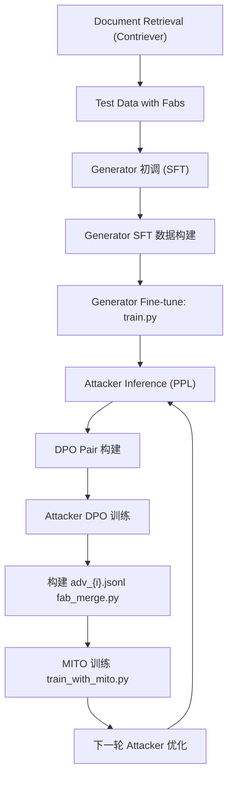

## Data download
```bash
sh ~/llm-fei/FiD/get-data.sh
```
## Data preparation
```bash
sh ./build_test.sh
```
It invokes the model to generate responses using prompts, e.g., the misleading answers for messages from the datasets.
Then the *fab_merge.py* is invoked to combine the fake data from *ask_output* with the original jsonl file, into a new jsonl file.
## Initial tuning of Generator
```bash
python ../atm_train/generator_sft/generator_sft_data_prepare.py
```

## Training
```bash
sh ./train.sh
```
```bash
OMP_NUM_THREADS=64 PYTORCH_CUDA_ALLOC_CONF=expandable_segments:True deepspeed /home/feihm/llm-fei/ATM-RAG/atm_train/generator_sft/train.py \
    --model_name_or_path Qwen/Qwen2.5-7B \
    --train_data /home/feihm/llm-fei/Data/ATM/test_data_with_fabs/NQ/attacked_train_fab_for_sft_arrows \
    --per_device_train_batch_size 1 \
    --per_device_eval_batch_size 1 \
    --gradient_accumulation_steps 4  \
    --bf16 \
    --deepspeed_file /home/feihm/llm-fei/ATM-RAG/atm_train/generator_sft/ds_cfg.json \
    --output_dir ./experiments/ \
    --lr_scheduler_type cosine \
    --num_train_epochs 1 \
    --learning_rate 5e-6
```

## Attacker DPO Optimization
Build the score data
```bash
sh attacker_dpo_opt.sh
```
```bash
OMP_NUM_THREADS=64 CUDA_VISIBLE_DEVICES=4,0 torchrun --nnodes=1 --nproc_per_node=2 \
    /home/feihm/llm-fei/ATM-RAG/atm_train/ppl_infer/ppl_infer_with_trainer.py \
    --model_name_or_path /home/feihm/llm-fei/ATM-RAG/fei-scripts/experiments/model_final/ \
    --input_file ${jsonl_root}/NQ_fab.jsonl \
    --per_device_eval_batch_size 32 \
    --output ${jsonl_root}/NQ_fab_score.csv
```

DPO training
```bash
accelerate launch --config_file ./acc.yaml --main_process_port 2950 train_dpo.py \
    --model_name_or_path /path/to/input/pretrained_models/atm_attacker_${epoch_suffix}/ \
    --train_data /path/to/input/datasets/attacker_train_fab_${epoch_suffix}/dpo/${ds_name}_dpo.jsonl \
    --gradient_accumulation_steps 4 \
    --gradient_checkpointing \
    --learning_rate 8e-7 \
    --lr_scheduler_type cosine \
    --num_train_epochs 1 \
    --output_dir ./experiments \
    --per_device_train_batch_size 2 \
    --per_device_eval_batch_size 2 \
    --max_length 4096 \
    --max_prompt_length 3072
```


1. The codes need modifications and dependency fixing. In 
```python
from transformers.models.llama.modeling_llama import *
import torch
import torch.nn as nn
import torch.nn.functional as F
from torch.nn import CrossEntropyLoss
from transformers.modeling_outputs import CausalLMOutputWithPast
from typing import Optional, List, Tuple, Union
```
2. There still exists some problem here since I am using LLama configuration for a Qwen model.

## MITO
```bash
accelerate launch --main_process_port 2950 --config_file ./acc.yaml train_with_mito.py \
    --model_name_or_path /path/to/input/pretrained_models/atm_generator_${epoch_suffix}/ \
    --train_data /path/to/input/datasets/atm_train_data/adv_${epoch_suffix}.jsonl \
    --beta 0.2 \
    --gradient_accumulation_steps 4 \
    --max_steps 100 \
    --gradient_checkpointing \
    --lr_scheduler_type cosine \
    --num_train_epochs 1 \
    --output_dir ./experiments \
    --per_device_train_batch_size 2 \
    --per_device_eval_batch_size 2 \
    --max_length 4096 \
    --max_prompt_length 4096 \ 
```


## Roadmap



## Issues
1. For trl, in trl/import_utils.py, add
```python
_peft_available = _is_package_available("peft")
_wandb_available = _is_package_available("wandb")

def is_wandb_available() -> bool:
    return _wandb_available

def is_peft_available() -> bool:
    return _peft_available
```

---------
## 全自动运行思路

### 准备
1. 准备初始fab数据 -->  \${FAB_DS_PATH}\${DS}.json
2. Fine tuning 模型 --> \$GEN_MODEL_PATH


### 循环
1. 
